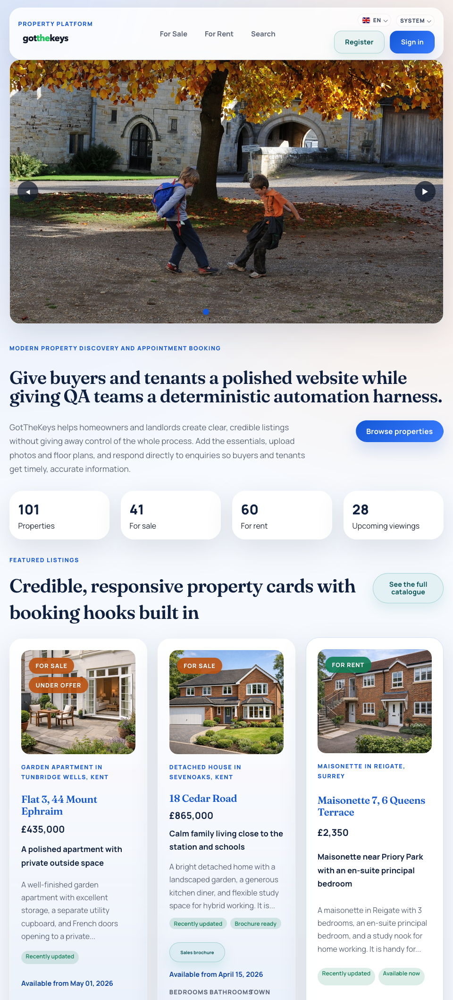

# Product Overview

## Contents

- [Documentation index](INDEX.md)
- [Main audiences](#main-audiences)
- [What users can do](#what-users-can-do)
- [Main entry points](#main-entry-points)
- [Why this works as a training product](#why-this-works-as-a-training-product)

GotTheKeys should be understood in two ways at the same time:

- a believable small estate-and-lettings website
- a deterministic QA training product

That dual purpose is intentional. The public site, seller tools, and admin workspace are written to feel coherent as a real property business product, but the data model, seeded scenarios, selectors, and admin diagnostics are shaped so trainers and test writers can reuse the app repeatedly.

## Main Audiences

- Trainers and contributors using the app to teach or practice browser automation, accessibility review, and performance testing.

## What Users Can Do

Public visitors can:

- browse the homepage and featured listings
- search and filter the catalogue
- open sale and rental property pages
- request a viewing
- send an enquiry
- submit an offer on sale listings
- submit a rental application on rental listings
- use secure self-service links for booked appointments

Signed-in sellers can:

- create and edit listings
- manage listing states and completeness
- upload or reference imagery
- manage photos, floor plans, and property documents
- review recent enquiries, offers, and rental applications

Admins can:

- sign in to a protected workspace
- manage appointments and status changes
- review properties and sellers
- use booking configuration controls
- inspect notification logs
- preview and reset demo scenarios
- use the in-app QA guide and diagnostics screens

## Why It Works As A Training Target

- Scenario packs live in version-controlled YAML.
- Public and admin journeys are stable enough for repeated browser automation.
- The product exposes stable `data-testid` selectors for key workflows.
- Status changes leave visible traces in timelines, flash messages, and admin views.
- Trainers can reset the dataset between exercises without reconstructing data manually.

## Important Entry Points

- `/` - homepage
- `/properties` - full catalogue
- `/for_sale` - sale-only catalogue
- `/for_rent` - rental-only catalogue
- `/searches` - shared search/filter surface
- `/admins/sign_in` - admin sign-in
- `/admin` - admin workspace
- `/admin/demo-data` - demo-data operations and resets
- `/admin/qa` - QA diagnostics and selector guidance

## Read Next

- [Getting started](GETTING_STARTED.md)
- [User manual](USER_MANUAL.md)
- [QA and testing guide](QA_TESTING_GUIDE.md)
- [Architecture overview](ARCHITECTURE_OVERVIEW.md)
